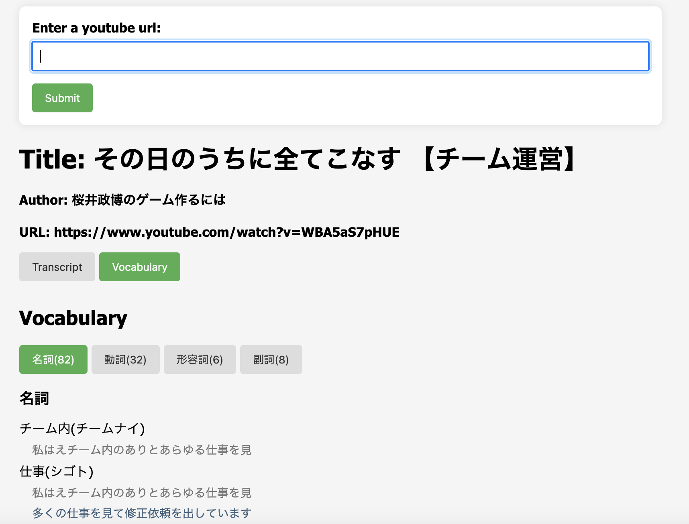

# Transcripts to Flashcards

This is a tool for listening practice in Japanese.

Before or after watching a video you can review the video transcripts and study from vocabulary lists.

## Getting starting

`pip install -r requirements.txt`

`python run.pry`

## Screenshot

